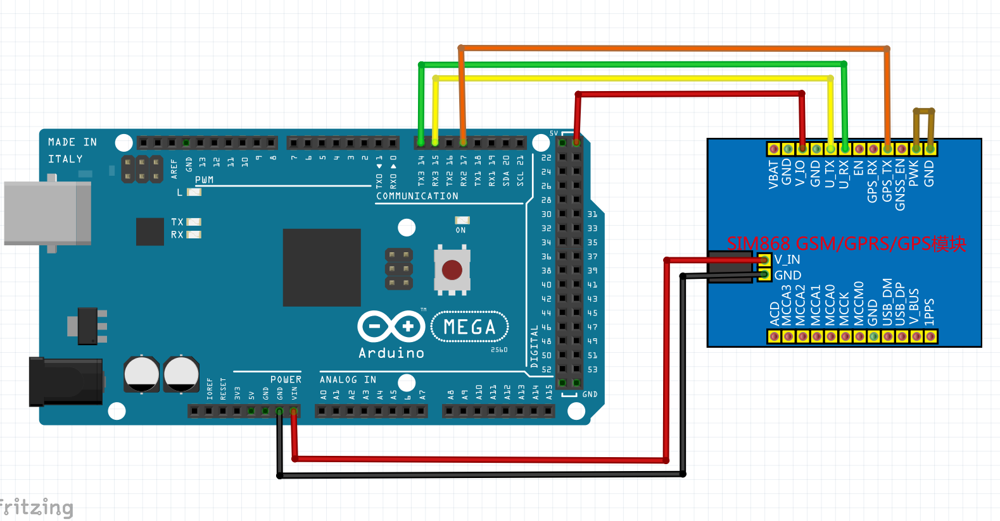

Folked from Seeeduino GPRS, do some modification to be compatible to SIM868 GPS/GPRS module.

## SIM868 GPRS/GPS Module

## Connection Diagram

NOTE: The serial port connection between this SIM868 module and MEGA2560 is based hardware UART, not like Seeeduino GPRS usage, so I apply some code modification, so far the examples/Serial, GPRS_HTTP, and GPRS_SMS have been modifed and work.
